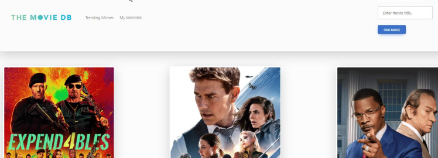

# Project-01: Movie Watchlist using TDMb Movie API

## Overview

* Browse trending movies or search specific by title

* Content generated will be dynamic

* Add & remove from watchlist feature

## Specific Goals (MVP)

* Content generated will be dynamic and displayed through a [carousel](https://www.w3schools.com/bootstrap/bootstrap_carousel.asp)

* Retrieving movie data using [TDMb's Movie API](https://developer.themoviedb.org/docs).

* Using `localStorage` and `JSON` methods to manipulate, store, and retrieved data from API.

* [Day.js](https://day.js.org/) for manipulating dates and times.

## Example Preview

## Deployment

* GitHub [Repository](https://github.com/Osorkon21/movie-watchlist)

* GitHub [Pages URL](https://osorkon21.github.io/movie-watchlist/)

## Project Team
- Joey Thao
- Sean Sutter
- Peter Krause
- Victor Montelongo
- Meriel Caballero

